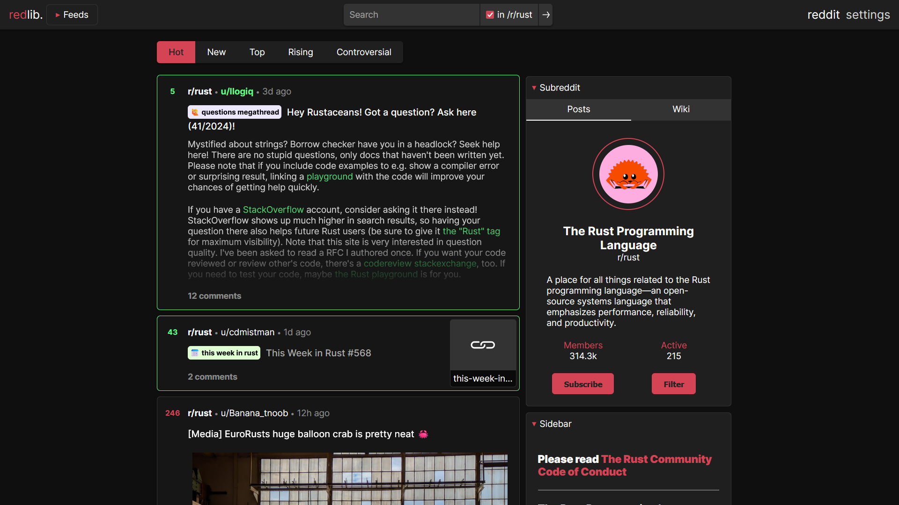

<!--
To README zostało automatycznie wygenerowane przez <https://github.com/YunoHost/apps/tree/master/tools/readme_generator>
Nie powinno być ono edytowane ręcznie.
-->

# Redlib dla YunoHost

[](https://ci-apps.yunohost.org/ci/apps/redlib/)


[](https://install-app.yunohost.org/?app=redlib)

*[Przeczytaj plik README w innym języku.](./ALL_README.md)*

> *Ta aplikacja pozwala na szybką i prostą instalację Redlib na serwerze YunoHost.*  
> *Jeżeli nie masz YunoHost zapoznaj się z [poradnikiem](https://yunohost.org/install) instalacji.*

## Przegląd

Redlib is an alternative private front-end to Reddit, with its origins in Libreddit. It is a private front-end like Invidious but for Reddit. Browse the coldest takes of r/unpopularopinion without being tracked.

### Features

- Written in Rust for blazing fast speeds and memory safety
- No JavaScript, no ads, no tracking, no bloat
- All requests are proxied through the server, including media
- Strong Content Security Policy prevents browser requests to Reddit


**Dostarczona wersja:** 0.35.1~ynh5

## Zrzuty ekranu



## Dokumentacja i zasoby

- Repozytorium z kodem źródłowym: <https://github.com/redlib-org/redlib>
- Sklep YunoHost: <https://apps.yunohost.org/app/redlib>
- Zgłaszanie błędów: <https://github.com/YunoHost-Apps/redlib_ynh/issues>

## Informacje od twórców

Wyślij swój pull request do [gałęzi `testing`](https://github.com/YunoHost-Apps/redlib_ynh/tree/testing).

Aby wypróbować gałąź `testing` postępuj zgodnie z instrukcjami:

```bash
sudo yunohost app install https://github.com/YunoHost-Apps/redlib_ynh/tree/testing --debug
lub
sudo yunohost app upgrade redlib -u https://github.com/YunoHost-Apps/redlib_ynh/tree/testing --debug
```

**Więcej informacji o tworzeniu paczek aplikacji:** <https://yunohost.org/packaging_apps>
